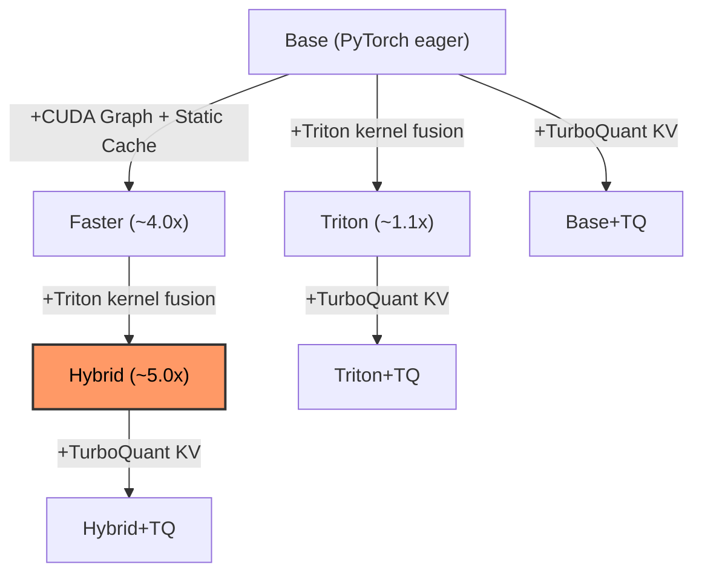

# Qwen3-TTS-Triton

[](https://github.com/newgrit1004/qwen3-tts-triton/actions/workflows/ci.yml)
[](https://pypi.org/project/qwen3-tts-triton/)
[](https://pypi.org/project/qwen3-tts-triton/)
[](https://opensource.org/licenses/Apache-2.0)

**Up to 5x faster Qwen3-TTS inference through Triton kernel fusion and TurboQuant KV cache.**

[Korean (한국어)](README_ko.md) | [Benchmark Results](docs/benchmark_results_en.md)

> [!NOTE]
> This project has only been tested on **RTX 5090 (Blackwell, sm_120)** with **WSL2** (CUDA 12.8, PyTorch nightly cu128).
> Triton kernels are architecture-agnostic (no sm_120-specific code), so they should work on other NVIDIA GPUs (A100, H100, RTX 4090, etc.), but this has **not been verified**. If you test on a different GPU, please open an issue or PR with your results!

---

Qwen3-TTS-Triton replaces performance-critical operators in [Qwen3-TTS 1.7B](https://huggingface.co/Qwen/Qwen3-TTS-12Hz-1.7B-CustomVoice) with hand-written [Triton](https://github.com/triton-lang/triton) kernels. Inspired by [Liger Kernel](https://github.com/linkedin/Liger-Kernel) (LinkedIn), each kernel fuses multiple HBM round-trips into a single pass, reducing memory traffic without any additional VRAM usage.

It can also be combined with [faster-qwen3-tts](https://github.com/andimarafioti/faster-qwen3-tts) (CUDA Graph + static KV-cache) as a **Hybrid** mode for maximum throughput. Hybrid+TQ is the current release-grade TurboQuant path. Base+TQ and Triton+TQ remain experimental until they pass the full Tier 3 gate.

### 💡 Why Triton?

- 🪶 **Lightweight & Portable** — No serving infrastructure needed. Just `pip install qwen3-tts-triton` and call `apply_triton_kernels()`. Works in standalone scripts, [ComfyUI nodes](https://github.com/newgrit1004/ComfyUI-Qwen3-TTS-Triton), Gradio apps, or any Python environment.
- 🎲 **Faster Iteration on Stochastic TTS** — Qwen3-TTS generates different output each run. For best results, generate multiple candidates and pick the best one. With Hybrid mode's **~5x speedup**, you can produce 5 candidates in the time it used to take for 1 — more takes, better results.

### 🌱 Why Optimize Qwen3-TTS?

Qwen3-TTS is rapidly becoming the backbone for next-generation TTS models. [Darwin-TTS](https://huggingface.co/blog/FINAL-Bench/darwin-tts) blends just 3% of general LLM weights back into the Qwen3-TTS-1.7B talker — a 10-second, training-free operation — to produce emotionally expressive speech. Projects like [OmniVoice](https://github.com/k2-fsa/OmniVoice) further demonstrate the Qwen3 architecture's versatility for multilingual, zero-shot TTS. As more derivative models build on Qwen3-TTS, **kernel-level speedups here propagate to the entire ecosystem** — every model that shares the same 28-layer transformer talker benefits from these Triton kernels with zero code changes.

### ✨ Highlights

- ⚡ **4 Fused Triton Kernels** — RMSNorm, SwiGLU, M-RoPE, Norm+Residual
- 🎯 **7 Inference Modes** — Base, Base+TQ, Triton, Triton+TQ, Faster, Hybrid, Hybrid+TQ
- 🗜️ **TurboQuant KV Cache** — INT4/INT3 calibration-free KV cache quantization for VRAM savings
- 🔬 **3-Tier Verification** — Kernel correctness → Model parity → E2E quality distribution
- 💾 **Zero Extra VRAM** — Pure kernel fusion, no model changes
- 🔌 **Drop-in Patching** — Single `apply_triton_kernels()` call, weight sharing via monkey-patch
- 📊 **Streamlit Dashboard** — Side-by-side comparison UI with live metrics

## 📦 Install

**Requirements**: Python 3.12+, CUDA 12.8+, NVIDIA GPU (8GB+ VRAM). Tested on WSL2 (Windows Subsystem for Linux 2).

### From PyPI

```bash
# 1. Install PyTorch with CUDA support first
pip install torch torchaudio --index-url https://download.pytorch.org/whl/cu128

# 2. Install qwen3-tts-triton
pip install qwen3-tts-triton
```

### From Source (development)

```bash
# Install UV (if not installed)
curl -LsSf https://astral.sh/uv/install.sh | sh

# Clone and setup
git clone https://github.com/newgrit1004/qwen3-tts-triton.git
cd qwen3-tts-triton
make setup  # uv sync --all-extras --dev + pre-commit install + git config
```

> **UV handles virtual environments automatically** — no need to manually activate a venv.
> All commands use the `uv run` prefix (e.g., `uv run pytest`, `uv run python script.py`).
> PyTorch is installed from the [cu128 index](https://download.pytorch.org/whl/cu128) automatically via `pyproject.toml`.

#### Dependency Groups

```bash
uv sync                 # Core (triton, transformers, faster-qwen3-tts, streamlit, plotly)
uv sync --extra eval    # + Quality evaluation (cohere-transcribe, jiwer, resemblyzer)
uv sync --extra dev     # + Dev tools (ruff, pytest, pre-commit)
uv sync --extra all     # Everything
```

## 🚀 Quick Start

> [!TIP]
> On first run, the model (~3.5GB) is automatically downloaded from HuggingFace.
> To download in advance: `huggingface-cli download Qwen/Qwen3-TTS-12Hz-1.7B-CustomVoice`

### Triton Mode

```python
from qwen3_tts_triton import TritonRunner
import soundfile as sf

runner = TritonRunner()
runner.load_model()  # Downloads model on first run (~3.5GB)

result = runner.generate(
    text="Hello, this is optimized with Triton kernels.",
    language="English",
    speaker="vivian",
)

# Save audio
sf.write("output.wav", result["audio"], result["sample_rate"])
print(f"Generated in {result['time_s']:.2f}s, VRAM: {result['peak_vram_gb']:.2f}GB")

runner.unload_model()
```

### Hybrid Mode (Triton + CUDA Graph, ~5x faster)

```python
from qwen3_tts_triton import TritonFasterRunner
import soundfile as sf

runner = TritonFasterRunner()
runner.load_model()  # Triton patches applied before CUDA Graph capture

result = runner.generate(
    text="Hybrid mode: CUDA Graph + Triton fusion.",
    language="English",
    speaker="vivian",
)

sf.write("output.wav", result["audio"], result["sample_rate"])
runner.unload_model()
```

### Hybrid+TQ Mode (Triton + CUDA Graph + TurboQuant KV Cache)

```python
from qwen3_tts_triton import TritonFasterRunner
import soundfile as sf

runner = TritonFasterRunner(enable_turboquant=True, tq_bits=4)
runner.load_model()  # Triton patches + TurboQuant KV cache injected before CUDA Graph capture

result = runner.generate(
    text="Hybrid+TQ mode: CUDA Graph + Triton fusion + INT4 KV cache.",
    language="English",
    speaker="vivian",
)

sf.write("output.wav", result["audio"], result["sample_rate"])
print(f"RTF: {result['rtf']:.2f}x, VRAM: {result['peak_vram_gb']:.2f}GB")
runner.unload_model()
```

> **Note**: TurboQuant quantizes the KV cache to INT4 (or INT3) at each decode step and is compatible with all runner modes via the `enable_turboquant=True` flag. In the current full Tier 3 release gate, Hybrid+TQ passes while Base+TQ and Triton+TQ remain caveated.

### 📊 Streamlit Dashboard

```bash
make ui  # http://localhost:8501
```

The dashboard provides:
- 🔄 Side-by-side inference comparison across all modes
- 📈 Live metrics (TTFA, RTF, Total Time, Peak VRAM)
- 📉 Plotly charts for visual comparison
- ✅ 3-Tier verification result cards

## 🎧 Audio Samples

Pre-generated samples comparing inference modes (custom voice + voice cloning).

| Mode | Directory |
|------|-----------|
| Base (PyTorch) | [`assets/audio_samples/base/`](assets/audio_samples/base/) |
| Base+TQ | [`assets/audio_samples/base+tq/`](assets/audio_samples/base+tq/) |
| Triton | [`assets/audio_samples/triton/`](assets/audio_samples/triton/) |
| Triton+TQ | [`assets/audio_samples/triton+tq/`](assets/audio_samples/triton+tq/) |
| Faster (CUDA Graph) | [`assets/audio_samples/faster/`](assets/audio_samples/faster/) |
| Hybrid (Faster+Triton) | [`assets/audio_samples/hybrid/`](assets/audio_samples/hybrid/) |
| Hybrid+TQ | [`assets/audio_samples/hybrid+tq/`](assets/audio_samples/hybrid+tq/) |

Each directory contains custom voice samples (5 Korean + 5 English) and voice cloning samples using [LJSpeech reference audio](assets/reference_audio/) (Public Domain).

> Use `make ui` → **Audio Samples** tab for side-by-side playback and comparison.
> Regenerate: `make generate-samples` (GPU required).

## ⚡ Triton Kernels

All kernels target the **Qwen3-TTS Talker** (28-layer Transformer, hidden_size=2048, intermediate=6144).

| Kernel | What It Fuses | HBM Savings | File |
|--------|--------------|-------------|------|
| **RMSNorm** | variance + normalize + scale in SRAM | 4→1 round-trips | `kernels/rms_norm.py` |
| **SwiGLU** | `silu(gate) * up` — eliminates intermediate tensor | 3→1 round-trips | `kernels/swiglu.py` |
| **M-RoPE** | 3D positional encoding (sections=[24,20,20]) | In-place compute | `kernels/rope.py` |
| **Fused Norm+Residual** | `residual + x` then RMSNorm in one kernel | 2 kernels → 1 | `kernels/fused_norm_residual.py` |

Additionally, **TurboQuant** (`kernels/turboquant.py`) provides INT4/INT3 KV cache quantization with calibration-free Lloyd-Max codebooks and Hadamard rotation for outlier suppression.

### 🔌 How Patching Works

`apply_triton_kernels()` performs in-place monkey-patching:

1. **RMSNorm modules** → replaced with `TritonRMSNorm` (shares original weights, zero copy)
2. **MLP forward** → patched to use `triton_swiglu_forward` (fused gate+up projection)
3. **Decoder layer forward** → patched for fused residual addition + normalization

```python
from qwen3_tts_triton.models.patching import apply_triton_kernels

# Patches all 28 decoder layers in-place (patch counts logged via logging)
apply_triton_kernels(model)
```

<details>
<summary><b>Advanced: Manual Patching</b></summary>

If you want to apply Triton kernels to a model loaded outside the Runner API:

```python
from qwen_tts import Qwen3TTSModel
from qwen3_tts_triton.models.patching import apply_triton_kernels
import torch

model = Qwen3TTSModel.from_pretrained(
    "Qwen/Qwen3-TTS-12Hz-1.7B-CustomVoice",
    device_map="cuda:0",
    dtype=torch.bfloat16,
)

# Patch the internal nn.Module (not the wrapper)
apply_triton_kernels(model.model)

wavs, sr = model.generate_custom_voice(
    text="Hello, this is optimized with Triton kernels.",
    language="English",
    speaker="vivian",
)
```

For Hybrid mode with manual patching, use `find_patchable_model()` to resolve the internal module:

```python
from faster_qwen3_tts import FasterQwen3TTS
from qwen3_tts_triton.models.patching import apply_triton_kernels, find_patchable_model

model = FasterQwen3TTS.from_pretrained(
    "Qwen/Qwen3-TTS-12Hz-1.7B-CustomVoice", device="cuda"
)

# FasterQwen3TTS wraps multiple layers: model.model.model reaches the nn.Module
internal = find_patchable_model(model.model)
apply_triton_kernels(internal)
```

</details>

## 🔬 3-Tier Verification

Inspired by [Liger Kernel](https://github.com/linkedin/Liger-Kernel) and industry practices from [vLLM](https://github.com/vllm-project/vllm) and [SGLang](https://github.com/sgl-project/sglang).

| Tier | What | Threshold | Time | Command |
|------|------|-----------|------|---------|
| **1. Kernel** | Kernel correctness + CPU-only regression guards | bf16: 0.05, fp16: 1e-3 | ~48s (RTX 5090 WSL2) | `make test` (197 tests) |
| **2. Model** | Layer-by-layer cosine similarity (2 pairs) | > 0.95 at layers 0,7,14,21,27 | ~46s (RTX 5090 WSL2) | `make test-parity` |
| **3. E2E** | Output quality distribution (UTMOS, CER, Speaker Sim) | See below | 15-80min | `make eval-fast` |

### Tier 3 Thresholds

Each model generates independently, then task-level metrics are compared via distribution analysis (not pair-level waveform comparison — stochastic TTS makes this unreliable).

| Metric | Threshold | Rationale |
|--------|-----------|-----------|
| UTMOS delta | \|mean\| < 0.3 | F5-TTS independent generation variance |
| UTMOS floor | Both > 2.5 | Absolute quality lower bound |
| CER delta | \|mean\| < 0.05 | SGLang 1-5% tolerance |
| Speaker Similarity | mean > 0.75 | Qwen3-TTS SIM > 0.79 |
| Mann-Whitney U | p > 0.05 (full mode) | Non-parametric distribution equivalence |

### Running Verification

```bash
make test          # Tier 1: Kernel tests
make test-parity   # Tier 2: Model parity (GPU required)
make verify        # Tier 1 + 2 + existing Tier 3 artifact report
make eval-fast     # Tier 3: Fast (~15min, Cohere Transcribe, 1 run/utterance)
make eval-full     # Tier 3: Full (~80min, Cohere Transcribe, 3 runs, Mann-Whitney)
make verify-all    # Run eval-full, then build the 3-Tier report
```

### 📋 Latest Results

✅ **Tier 1**: All kernel tests PASS

✅ **Tier 2**: 2 pairs tested, all PASS

**Pair A — Base ↔ Triton** (cosine > 0.997):

| Layer | Cosine Sim |
|-------|-----------|
| L0 | 0.999995 |
| L7 | 0.999977 |
| L14 | 0.999852 |
| L21 | 0.999177 |
| L27 | 0.997900 |
| Output | 0.997156 |

**Pair B — Faster ↔ Hybrid** (cosine > 0.997): PASS

> FP accumulation naturally decreases similarity across 28 layers — this is expected behavior for fused kernels that change operation order.

## 📊 Benchmarks

<!-- BENCH:SUMMARY:START -->
> __Hybrid (Faster+Triton)__ achieves __5.0x__ faster inference than PyTorch baseline at equivalent VRAM on RTX 5090.
<!-- BENCH:SUMMARY:END -->

### 🏗️ Optimization Modes



> TurboQuant (+TQ) variants share the same INT4 KV-cache path, but the current full Tier 3 release gate passes only for Hybrid+TQ.

```bash
make bench-kernels  # Per-kernel micro-benchmarks (PyTorch vs Triton)
make bench-e2e      # End-to-end inference (all runners)
make bench          # Default suite (kernels + speed + fast quality + report)
make profile        # torch.profiler trace
```

<details>
<summary><b>Hardware & Methodology</b></summary>

| Item | Spec |
|------|------|
| GPU | NVIDIA RTX 5090 (Blackwell, sm_120, 32GB) |
| CUDA | 12.8 |
| PyTorch | nightly (cu128) |
| Triton | 3.2.0 |
| Model | Qwen3-TTS-12Hz-1.7B (1.7B params) |
| OS | WSL2 (Linux 5.15) |
| Python | 3.12 |
| Dtype | bfloat16 |
| Batch Size | 1 |

**Kernel benchmarks**: `triton.testing.do_bench()`, batch=1, seq_len=512, hidden=2048.
**E2E benchmarks**: `torch.cuda.Event` timing, 3 warmup + 20 measured runs per text.
RTF (Real-Time Factor) = audio_duration / generation_time. RTF > 1 means faster-than-real-time.

</details>

### ⚡ Kernel Micro-Benchmarks

<!-- BENCH:KERNEL:START -->
> RTX 5090, bf16, batch=1, seq_len=512, hidden=2048. Run `make bench-kernels` to reproduce.

| Kernel | PyTorch (us) | Triton (us) | Speedup | Compile (s) | HBM Savings |
|--------|:------------:|:-----------:|:-------:|:-----------:|:-----------:|
| RMSNorm | 40.9 | **7.4** | **5.51x** | 0.34 | 4→1 trips |
| SwiGLU | 19.4 | **16.0** | **1.21x** | 0.00 | 3→1 trips |
| M-RoPE | 367.9 | **37.3** | **9.87x** | 0.02 | In-place |
| Fused Norm+Residual | 40.6 | **9.0** | **4.49x** | 0.00 | 2→1 kernels |
<!-- BENCH:KERNEL:END -->

### 🏎️ E2E Inference

<!-- BENCH:E2E:START -->
> RTX 5090, bf16, 2 texts (ko + en), 3 warmup + 20 runs each. Run `make bench-e2e` to reproduce.

| Mode | Load Time | Latency (ko) | Latency (en) | RTF (ko) | RTF (en) | vs Base | Peak VRAM |
|------|:---------:|:------------:|:------------:|:--------:|:--------:|:-------:|:---------:|
| Base (PyTorch) | 17.5s | 4,615 ms | 5,081 ms | 0.88x | 0.90x | 1.0x | 4.03 GB |
| Base+TQ | 8.3s | 9,030 ms | 5,745 ms | 0.82x | 0.79x | 0.7x | 4.07 GB |
| Triton | 7.9s | 4,130 ms | 4,462 ms | 1.00x | 1.00x | 1.1x | 4.03 GB |
| Triton+TQ | 7.4s | 8,045 ms | 5,877 ms | 0.93x | 0.88x | 0.7x | 4.09 GB |
| Faster | 9.2s | 1,136 ms | 1,265 ms | 3.49x | 3.52x | 4.0x | 4.28 GB |
| __Hybrid (Faster+Triton)__ | 6.0s | **886 ms** | 1,042 ms | 4.20x | **4.26x** | **5.0x** | 4.32 GB |
| Hybrid+TQ | 6.5s | 944 ms | **1,032 ms** | **4.27x** | 4.25x | 4.9x | 4.33 GB |

> Triton/Triton+TQ/Hybrid/Hybrid+TQ use the default partial patch range `[0, 24)`; the final 4 decoder layers stay in PyTorch for pronunciation stability.
<!-- BENCH:E2E:END -->

### 🎵 Audio Quality (Tier 3)

<!-- BENCH:QUALITY:START -->
Official release quality numbers use full mode as the canonical Tier 3 result.

| Runner | UTMOS | CER | Speaker Sim | Status |
|--------|:-----:|:---:|:-----------:|:------:|
| Base (ref) | 3.40 ± 0.78 | 0.04 ± 0.06 | - | ref |
| Base+TQ (`base+tq`) | 3.17 ± 0.81 | 0.42 ± 2.02 | 0.82 | FAIL |
| Triton (`triton`) | 3.40 ± 0.76 | 0.04 ± 0.07 | 0.85 | PASS |
| Triton+TQ (`triton+tq`) | 3.04 ± 0.83 | 0.43 ± 1.49 | 0.83 | FAIL |
| Faster (`faster`) | 3.42 ± 0.75 | 0.04 ± 0.04 | 0.83 | PASS |
| Hybrid (`hybrid`) | 3.38 ± 0.78 | 0.04 ± 0.06 | 0.83 | PASS |
| Hybrid+TQ (`hybrid+tq`) | 3.32 ± 0.78 | 0.05 ± 0.07 | 0.83 | PASS |

Release caveats (full mode):
- `base+tq`: FAIL - CER delta 0.3801 > 0.05; Mann-Whitney p=0.0340 < 0.05
- `triton+tq`: FAIL - UTMOS delta 0.3565 > 0.3; CER delta 0.3865 > 0.05; Mann-Whitney p=0.0015 < 0.05

Run `make eval-full` to reproduce. Treat fast mode as a smoke check, not the release authority.
<!-- BENCH:QUALITY:END -->

> **Disclaimer**: Benchmarks measured on a single RTX 5090. Results vary with GPU model, driver version, system load, and input text length. Run `make bench` on your hardware for accurate numbers.

## 📁 Project Structure

```
qwen3-tts-triton/
├── src/
│   └── qwen3_tts_triton/           # PyPI package
│       ├── __init__.py              # Public API + __version__
│       ├── py.typed                 # PEP 561 type marker
│       ├── kernels/                 # Triton GPU kernels
│       │   ├── rms_norm.py          # Fused RMSNorm
│       │   ├── swiglu.py            # Fused SwiGLU
│       │   ├── rope.py              # Fused M-RoPE
│       │   ├── fused_norm_residual.py # Fused Norm+Residual
│       │   └── turboquant.py        # TurboQuant INT4/INT3 KV cache
│       └── models/                  # Model runners & patching
│           ├── patching.py          # Monkey-patch logic (partial patching support)
│           ├── base_runner.py       # Standard PyTorch (+ TurboQuant option)
│           ├── triton_runner.py     # Triton-optimized
│           ├── faster_runner.py     # faster-qwen3-tts wrapper
│           └── triton_faster_runner.py # Hybrid (faster + Triton + TQ option)
├── tests/                           # Verification tests
│   ├── kernels/                     # Tier 1: Kernel correctness
│   └── test_model_parity.py         # Tier 2: Model parity (2 pairs)
├── benchmark/                       # Benchmarking suite
│   └── results/                     # Saved benchmark JSON outputs
├── ui/                              # Streamlit dashboard
├── docs/                            # Documentation
├── pyproject.toml                   # Project config (UV + hatchling)
├── uv.lock                          # Locked dependencies
└── Makefile                         # Development commands
```

## 🛠️ Development

```bash
make format      # Ruff formatting
make lint        # Ruff linting
make lint-fix    # Ruff auto-fix
make test        # pytest (Tier 1)
make test-cov    # pytest + coverage
make check       # lint + test
make pre-commit  # All pre-commit hooks
make clean       # Clear caches
```

### 🧠 Qwen3-TTS Talker Architecture

| Parameter | Value |
|-----------|-------|
| Model | Qwen3-TTS-12Hz-1.7B-CustomVoice |
| Hidden Size | 2048 |
| Attention Heads | 16 (GQA, kv_heads=8) |
| Head Dim | 128 |
| Intermediate Size | 6144 |
| Layers | 28 |
| RMS Norm Eps | 1e-6 |
| Position Encoding | M-RoPE (sections=[24,20,20]) |
| Activation | SwiGLU |

## 🔄 Compatibility

### 🎤 Voice Modes by Runner

| Feature | Base | Base+TQ | Triton | Triton+TQ | Faster | Hybrid | Hybrid+TQ |
|---------|:----:|:-------:|:------:|:---------:|:------:|:------:|:---------:|
| Custom Voice | Yes | Yes | Yes | Yes | Yes | Yes | Yes |
| Voice Cloning | Yes | Yes | Yes | Yes | Yes | Yes | Yes |
| Voice Design | -- | -- | -- | -- | Yes | Yes | Yes |
| Streaming | -- | -- | -- | -- | Yes | Yes | Yes |
| Dynamic Shape | Yes | Yes | Yes | Yes | Yes | Yes | Yes |
| bfloat16 / float16 | Yes | Yes | Yes | Yes | Yes | Yes | Yes |
| TurboQuant KV | -- | Yes | -- | Yes | -- | -- | Yes |

### 💻 Platform Support

| Platform | Supported |
|----------|-----------|
| Linux | Yes |
| Windows WSL2 | Yes |

## 🗺️ TODO

- [ ] Docker deployment
- [x] TurboQuant INT4/INT3 KV cache quantization (Base+TQ, Triton+TQ, Hybrid+TQ modes)
- [x] Partial Patching — selective layer patching for pronunciation accuracy
- [ ] [SageAttention](https://github.com/thu-ml/SageAttention) integration — INT8 quantized attention
- [ ] [ComfyUI-Qwen3-TTS-Triton](https://github.com/newgrit1004/ComfyUI-Qwen3-TTS-Triton) — ComfyUI custom node
- [ ] Multi-GPU architecture testing (A100, H100, RTX 4090, etc.)

## 📄 License

Apache-2.0

## 🙏 Acknowledgments

- [Qwen3-TTS](https://github.com/QwenLM/Qwen3-TTS) — Base TTS model
- [Liger Kernel](https://github.com/linkedin/Liger-Kernel) — Triton kernel design patterns and verification methodology
- [faster-qwen3-tts](https://github.com/andimarafioti/faster-qwen3-tts) — CUDA Graph optimization for Hybrid mode
- [Triton](https://github.com/triton-lang/triton) — GPU kernel compiler
