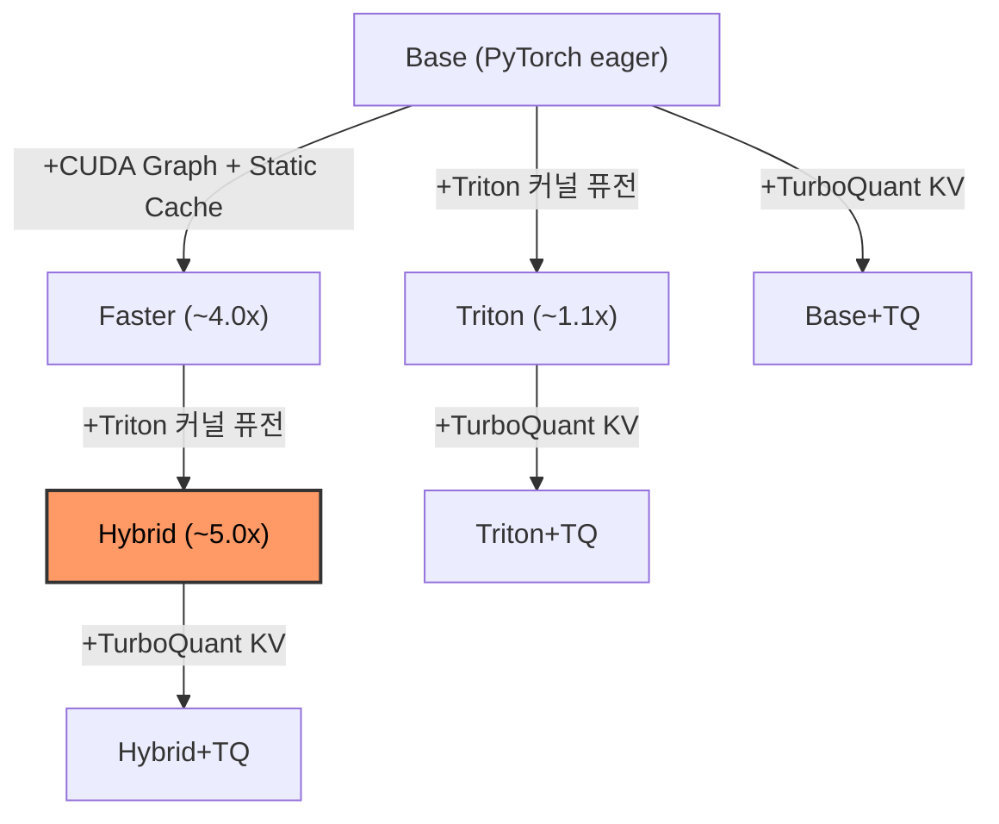

# Qwen3-TTS-Triton

[](https://github.com/newgrit1004/qwen3-tts-triton/actions/workflows/ci.yml)
[](https://pypi.org/project/qwen3-tts-triton/)
[](https://pypi.org/project/qwen3-tts-triton/)
[](https://opensource.org/licenses/Apache-2.0)

**Triton 커널 퓨전으로 Qwen3-TTS 추론 최대 5배 가속.**

[English](README.md) | [벤치마크 결과](docs/benchmark_results_ko.md)

> [!NOTE]
> 이 프로젝트는 **RTX 5090 (Blackwell, sm_120)** + **WSL2** (CUDA 12.8, PyTorch nightly cu128) 환경에서만 테스트되었습니다.
> Triton 커널은 아키텍처 독립적으로 작성되어 (sm_120 전용 코드 없음) 다른 NVIDIA GPU (A100, H100, RTX 4090 등)에서도 동작할 것으로 예상되지만, **검증되지 않았습니다**. 다른 GPU에서 테스트하셨다면 이슈 또는 PR로 결과를 공유해 주세요!

---

Qwen3-TTS-Triton은 [Qwen3-TTS 1.7B](https://huggingface.co/Qwen/Qwen3-TTS-12Hz-1.7B-CustomVoice)의 성능 병목 연산자를 직접 작성한 [Triton](https://github.com/triton-lang/triton) 커널로 대체합니다. [Liger Kernel](https://github.com/linkedin/Liger-Kernel) (LinkedIn)에서 영감을 받아, 각 커널은 여러 번의 HBM 왕복을 단일 패스로 퓨전하여 메모리 트래픽을 줄이면서 추가 VRAM 사용 없이 동작합니다.

[faster-qwen3-tts](https://github.com/andimarafioti/faster-qwen3-tts) (CUDA Graph + 정적 KV-cache)와 결합한 **Hybrid** 모드로 최대 처리량을 달성할 수 있습니다. Hybrid+TQ가 현재 공개 기준의 TurboQuant 경로입니다. Base+TQ와 Triton+TQ는 full Tier 3 게이트를 통과하기 전까지 experimental로 보는 편이 맞습니다.

### 💡 왜 Triton인가?

- 🪶 **경량 & 이식성** — 별도 서빙 인프라 불필요. `pip install qwen3-tts-triton` 후 `apply_triton_kernels()` 한 줄이면 끝. 독립 스크립트, [ComfyUI 노드](https://github.com/newgrit1004/ComfyUI-Qwen3-TTS-Triton), Gradio 앱 등 어디서든 사용 가능.
- 🎲 **Stochastic TTS를 위한 빠른 반복** — Qwen3-TTS는 매 실행마다 다른 결과를 생성합니다. 최고 품질을 위해 여러 후보를 생성하고 가장 좋은 것을 선택하세요. Hybrid 모드의 **~5x 속도 향상**으로, 기존에 1개 생성할 시간에 5개를 생성할 수 있습니다 — 더 많은 후보, 더 나은 결과.

### 🌱 왜 Qwen3-TTS를 최적화하는가?

Qwen3-TTS는 차세대 TTS 모델의 백본으로 빠르게 자리잡고 있습니다. [Darwin-TTS](https://huggingface.co/blog/FINAL-Bench/darwin-tts)는 범용 LLM 가중치의 3%만 Qwen3-TTS-1.7B talker에 블렌딩하는 것만으로 — 학습 없이 10초 만에 — 감정이 실린 음성을 생성합니다. [OmniVoice](https://github.com/k2-fsa/OmniVoice) 같은 프로젝트도 Qwen3 아키텍처의 다국어 제로샷 TTS 활용 가능성을 보여줍니다. Qwen3-TTS 기반 파생 모델이 늘어날수록, **여기서의 커널 수준 최적화는 전체 생태계로 전파됩니다** — 동일한 28-layer transformer talker를 공유하는 모든 모델이 코드 수정 없이 이 Triton 커널의 혜택을 받습니다.

### ✨ 주요 특징

- ⚡ **4개 Fused Triton 커널** — RMSNorm, SwiGLU, M-RoPE, Norm+Residual
- 🎯 **7가지 추론 모드** — Base, Base+TQ, Triton, Triton+TQ, Faster, Hybrid, Hybrid+TQ
- 🗜️ **TurboQuant KV Cache** — INT4/INT3 calibration-free KV 캐시 양자화로 VRAM 절감
- 🔬 **3-Tier 검증 체계** — 커널 정확도 → 모델 패리티 → E2E 품질 분포
- 💾 **추가 VRAM 제로** — 순수 커널 퓨전, 모델 구조 변경 없음
- 🔌 **드롭인 패칭** — `apply_triton_kernels()` 한 줄로 적용, 가중치 공유 monkey-patch
- 📊 **Streamlit 대시보드** — 실시간 메트릭과 함께 나란히 비교하는 UI

## 📦 설치

**요구사항**: Python 3.12+, CUDA 12.8+, NVIDIA GPU (8GB+ VRAM). WSL2 (Windows Subsystem for Linux 2) 환경에서 테스트됨.

### PyPI에서 설치

```bash
# 1. CUDA 지원 PyTorch 먼저 설치
pip install torch torchaudio --index-url https://download.pytorch.org/whl/cu128

# 2. qwen3-tts-triton 설치
pip install qwen3-tts-triton
```

### 소스에서 설치 (개발용)

```bash
# UV 설치 (미설치 시)
curl -LsSf https://astral.sh/uv/install.sh | sh

# 클론 및 설정
git clone https://github.com/newgrit1004/qwen3-tts-triton.git
cd qwen3-tts-triton
make setup  # uv sync --all-extras --dev + pre-commit install + git config
```

> **UV는 가상환경을 자동으로 관리합니다** — 수동으로 venv를 활성화할 필요가 없습니다.
> 모든 명령어는 `uv run` 접두사를 사용합니다 (예: `uv run pytest`, `uv run python script.py`).
> PyTorch는 `pyproject.toml`의 설정을 통해 [cu128 인덱스](https://download.pytorch.org/whl/cu128)에서 자동 설치됩니다.

#### 의존성 그룹

```bash
uv sync                 # 코어 (triton, transformers, faster-qwen3-tts, streamlit, plotly)
uv sync --extra eval    # + 품질 평가 (cohere-transcribe, jiwer, resemblyzer)
uv sync --extra dev     # + 개발 도구 (ruff, pytest, pre-commit)
uv sync --extra all     # 전부
```

## 🚀 빠른 시작

> [!TIP]
> 첫 실행 시 HuggingFace에서 모델이 자동 다운로드됩니다 (~3.5GB).
> 사전 다운로드: `huggingface-cli download Qwen/Qwen3-TTS-12Hz-1.7B-CustomVoice`

### Triton 모드

```python
from qwen3_tts_triton import TritonRunner
import soundfile as sf

runner = TritonRunner()
runner.load_model()  # 첫 실행 시 모델 자동 다운로드 (~3.5GB)

result = runner.generate(
    text="Triton 커널로 최적화된 음성 합성입니다.",
    language="Korean",
    speaker="vivian",
)

# 오디오 저장
sf.write("output.wav", result["audio"], result["sample_rate"])
print(f"생성 시간: {result['time_s']:.2f}초, VRAM: {result['peak_vram_gb']:.2f}GB")

runner.unload_model()
```

### Hybrid 모드 (Triton + CUDA Graph, ~5x 빠름)

```python
from qwen3_tts_triton import TritonFasterRunner
import soundfile as sf

runner = TritonFasterRunner()
runner.load_model()  # CUDA Graph 캡처 전에 Triton 패치 자동 적용

result = runner.generate(
    text="Hybrid 모드: CUDA Graph + Triton 퓨전.",
    language="Korean",
    speaker="vivian",
)

sf.write("output.wav", result["audio"], result["sample_rate"])
runner.unload_model()
```

### 📊 Streamlit 대시보드

```bash
make ui  # http://localhost:8501
```

대시보드 기능:
- 🔄 모든 모드의 나란히 추론 비교
- 📈 실시간 메트릭 (TTFA, RTF, 총 시간, 피크 VRAM)
- 📉 Plotly 차트를 통한 시각적 비교
- ✅ 3-Tier 검증 결과 카드

## 🎧 오디오 샘플

추론 모드별 비교를 위한 사전 생성 샘플입니다 (커스텀 음성 + 음성 클로닝).

| 모드 | 디렉토리 |
|------|-----------|
| Base (PyTorch) | [`assets/audio_samples/base/`](assets/audio_samples/base/) |
| Base+TQ | [`assets/audio_samples/base+tq/`](assets/audio_samples/base+tq/) |
| Triton | [`assets/audio_samples/triton/`](assets/audio_samples/triton/) |
| Triton+TQ | [`assets/audio_samples/triton+tq/`](assets/audio_samples/triton+tq/) |
| Faster (CUDA Graph) | [`assets/audio_samples/faster/`](assets/audio_samples/faster/) |
| Hybrid (Faster+Triton) | [`assets/audio_samples/hybrid/`](assets/audio_samples/hybrid/) |
| Hybrid+TQ | [`assets/audio_samples/hybrid+tq/`](assets/audio_samples/hybrid+tq/) |

각 디렉토리에는 커스텀 음성 샘플 (한국어 5개 + 영어 5개)과 [LJSpeech 참조 오디오](assets/reference_audio/) (Public Domain)를 사용한 음성 클로닝 샘플이 포함됩니다.

> `make ui` → **오디오 샘플** 탭에서 나란히 재생하고 비교해보세요.
> 재생성: `make generate-samples` (GPU 필요).

## ⚡ Triton 커널

모든 커널은 **Qwen3-TTS Talker** (28-layer Transformer, hidden_size=2048, intermediate=6144)를 대상으로 합니다.

| 커널 | 퓨전 대상 | HBM 절감 | 파일 |
|------|----------|----------|------|
| **RMSNorm** | variance + normalize + scale을 SRAM에서 처리 | 4→1 왕복 | `kernels/rms_norm.py` |
| **SwiGLU** | `silu(gate) * up` — 중간 텐서 제거 | 3→1 왕복 | `kernels/swiglu.py` |
| **M-RoPE** | 3D 위치 인코딩 (sections=[24,20,20]) | In-place 연산 | `kernels/rope.py` |
| **Fused Norm+Residual** | `residual + x` 후 RMSNorm을 단일 커널로 | 2 커널 → 1 | `kernels/fused_norm_residual.py` |

### 🔌 패칭 동작 원리

`apply_triton_kernels()`은 in-place monkey-patching을 수행합니다:

1. **RMSNorm 모듈** → `TritonRMSNorm`으로 교체 (원본 가중치 공유, 제로 카피)
2. **MLP forward** → `triton_swiglu_forward` 사용으로 패치 (gate+up 프로젝션 퓨전)
3. **Decoder layer forward** → residual 덧셈 + 정규화 퓨전으로 패치

```python
from qwen3_tts_triton.models.patching import apply_triton_kernels

# 28개 디코더 레이어를 모두 in-place 패치 (패치 수는 logging으로 출력)
apply_triton_kernels(model)
```

<details>
<summary><b>고급: 수동 패칭</b></summary>

Runner API 외부에서 로드한 모델에 Triton 커널을 적용하려면:

```python
from qwen_tts import Qwen3TTSModel
from qwen3_tts_triton.models.patching import apply_triton_kernels
import torch

model = Qwen3TTSModel.from_pretrained(
    "Qwen/Qwen3-TTS-12Hz-1.7B-CustomVoice",
    device_map="cuda:0",
    dtype=torch.bfloat16,
)

# 래퍼가 아닌 내부 nn.Module에 패치 적용
apply_triton_kernels(model.model)

wavs, sr = model.generate_custom_voice(
    text="Triton 커널로 최적화된 음성 합성입니다.",
    language="Korean",
    speaker="vivian",
)
```

Hybrid 모드에서 수동 패칭 시, `find_patchable_model()`로 내부 모듈을 찾습니다:

```python
from faster_qwen3_tts import FasterQwen3TTS
from qwen3_tts_triton.models.patching import apply_triton_kernels, find_patchable_model

model = FasterQwen3TTS.from_pretrained(
    "Qwen/Qwen3-TTS-12Hz-1.7B-CustomVoice", device="cuda"
)

# FasterQwen3TTS는 여러 레이어를 감쌈: model.model.model이 실제 nn.Module
internal = find_patchable_model(model.model)
apply_triton_kernels(internal)
```

</details>

## 🔬 3-Tier 검증 체계

[Liger Kernel](https://github.com/linkedin/Liger-Kernel)과 [vLLM](https://github.com/vllm-project/vllm), [SGLang](https://github.com/sgl-project/sglang)의 업계 사례에서 영감을 받았습니다.

| Tier | 검증 대상 | 임계값 | 소요 시간 | 명령어 |
|------|----------|--------|----------|--------|
| **1. 커널** | 커널 정확도 + CPU 회귀 가드 | bf16: 0.05, fp16: 1e-3 | ~48초 (RTX 5090 WSL2) | `make test` (197 tests) |
| **2. 모델** | 레이어별 코사인 유사도 | > 0.95 (레이어 0,7,14,21,27) | ~46초 (RTX 5090 WSL2) | `make test-parity` |
| **3. E2E** | 출력 품질 분포 (UTMOS, CER, Speaker Sim) | 아래 참조 | 15-80분 | `make eval-fast` |

### Tier 3 임계값

각 모델이 독립적으로 생성한 후, 태스크 레벨 메트릭을 분포 분석으로 비교합니다 (stochastic TTS에서 pair-level 파형 비교는 신뢰할 수 없기 때문).

| 메트릭 | 임계값 | 근거 |
|--------|--------|------|
| UTMOS 델타 | \|mean\| < 0.3 | F5-TTS 독립 생성 변동 |
| UTMOS 하한 | 양쪽 > 2.5 | 절대 품질 하한 |
| CER 델타 | \|mean\| < 0.05 | SGLang 1-5% 허용 |
| Speaker 유사도 | mean > 0.75 | Qwen3-TTS SIM > 0.79 |
| Mann-Whitney U | p > 0.05 (full 모드) | 비모수 분포 동등성 |

### 검증 실행

```bash
make test          # Tier 1: 197 tests
make test-parity   # Tier 2: 모델 패리티 (GPU 필요)
make verify        # Tier 1 + 2 + 기존 Tier 3 결과 리포트
make eval-fast     # Tier 3: 빠른 평가 (~15분, Cohere Transcribe, 1회/문장)
make eval-full     # Tier 3: 전체 평가 (~80분, Cohere Transcribe, 3회, Mann-Whitney)
make verify-all    # eval-full 실행 후 3-Tier 리포트 생성
```

### 📋 최신 결과

✅ **Tier 1**: 90/90 PASS

✅ **Tier 2**: 모든 레이어 > 0.95 코사인 유사도

| 레이어 | 코사인 유사도 |
|--------|-------------|
| L0 | 0.999995 |
| L7 | 0.999977 |
| L14 | 0.999852 |
| L21 | 0.999177 |
| L27 | 0.997900 |
| Output | 0.997156 |

> FP 누적 오차로 인해 28개 레이어를 거치면서 유사도가 자연스럽게 감소합니다 — 연산 순서를 변경하는 퓨전 커널의 예상된 동작입니다.

## 📊 벤치마크

<!-- BENCH:SUMMARY:START -->
> __Hybrid (Faster+Triton)__ 모드는 RTX 5090에서 PyTorch 기본 대비 __5.0x__ 빠른 추론을 동일 VRAM으로 달성합니다.
<!-- BENCH:SUMMARY:END -->

### 🏗️ 최적화 모드



> +TQ 모드는 모두 같은 INT4 KV 캐시 경로를 쓰지만, 현재 full Tier 3 릴리스 게이트를 통과한 건 Hybrid+TQ뿐입니다.

```bash
make bench-kernels  # 커널별 마이크로벤치마크 (PyTorch vs Triton)
make bench-e2e      # E2E 추론 (전체 러너)
make bench          # 기본 세트 (커널 + 속도 + 빠른 품질 평가 + 리포트)
make profile        # torch.profiler 트레이스
```

<details>
<summary><b>하드웨어 및 측정 방법</b></summary>

| 항목 | 사양 |
|------|------|
| GPU | NVIDIA RTX 5090 (Blackwell, sm_120, 32GB) |
| CUDA | 12.8 |
| PyTorch | nightly (cu128) |
| Triton | 3.2.0 |
| 모델 | Qwen3-TTS-12Hz-1.7B (1.7B params) |
| OS | WSL2 (Linux 5.15) |
| Python | 3.12 |
| Dtype | bfloat16 |
| 배치 크기 | 1 |

**커널 벤치마크**: `triton.testing.do_bench()`, batch=1, seq_len=512, hidden=2048.
**E2E 벤치마크**: `torch.cuda.Event` 타이밍, 3회 워밍업 + 20회 측정.
RTF (Real-Time Factor) = audio_duration / generation_time. RTF > 1이면 실시간보다 빠름.

</details>

### ⚡ 커널 마이크로벤치마크

<!-- BENCH:KERNEL:START -->
> RTX 5090, bf16, batch=1, seq_len=512, hidden=2048. `make bench-kernels`로 재현 가능.

| 커널 | PyTorch (us) | Triton (us) | 속도 향상 | 컴파일 (s) | HBM 절감 |
|------|:------------:|:-----------:|:---------:|:----------:|:--------:|
| RMSNorm | 40.9 | **7.4** | **5.51x** | 0.34 | 4→1 왕복 |
| SwiGLU | 19.4 | **16.0** | **1.21x** | 0.00 | 3→1 왕복 |
| M-RoPE | 367.9 | **37.3** | **9.87x** | 0.02 | In-place |
| Fused Norm+Residual | 40.6 | **9.0** | **4.49x** | 0.00 | 2→1 커널 |
<!-- BENCH:KERNEL:END -->

### 🏎️ E2E 추론

<!-- BENCH:E2E:START -->
> RTX 5090, bf16, 2개 텍스트 (ko + en), 3회 워밍업 + 20회 측정. `make bench-e2e`로 재현 가능.

| 모드 | 로드 시간 | 지연 (한국어) | 지연 (영어) | RTF (ko) | RTF (en) | Base 대비 | 피크 VRAM |
|------|:---------:|:------------:|:------------:|:--------:|:--------:|:-------:|:---------:|
| Base (PyTorch) | 17.5s | 4,615 ms | 5,081 ms | 0.88x | 0.90x | 1.0x | 4.03 GB |
| Base+TQ | 8.3s | 9,030 ms | 5,745 ms | 0.82x | 0.79x | 0.7x | 4.07 GB |
| Triton | 7.9s | 4,130 ms | 4,462 ms | 1.00x | 1.00x | 1.1x | 4.03 GB |
| Triton+TQ | 7.4s | 8,045 ms | 5,877 ms | 0.93x | 0.88x | 0.7x | 4.09 GB |
| Faster | 9.2s | 1,136 ms | 1,265 ms | 3.49x | 3.52x | 4.0x | 4.28 GB |
| __Hybrid (Faster+Triton)__ | 6.0s | **886 ms** | 1,042 ms | 4.20x | **4.26x** | **5.0x** | 4.32 GB |
| Hybrid+TQ | 6.5s | 944 ms | **1,032 ms** | **4.27x** | 4.25x | 4.9x | 4.33 GB |

> Triton/Triton+TQ/Hybrid/Hybrid+TQ 수치는 기본 partial patch range `[0, 24)` 설정 기준이며, 마지막 4개 decoder 레이어는 발음 안정성을 위해 PyTorch로 남겨둡니다.
<!-- BENCH:E2E:END -->

### 🎵 오디오 품질 (Tier 3)

<!-- BENCH:QUALITY:START -->
공식 릴리스 품질 수치는 full 모드 기준으로 정리했습니다.

| 러너 | UTMOS | CER | Speaker Sim | 상태 |
|--------|:-----:|:---:|:-----------:|:----:|
| Base (기준) | 3.40 ± 0.78 | 0.04 ± 0.06 | - | 기준 |
| Base+TQ (`base+tq`) | 3.17 ± 0.81 | 0.42 ± 2.02 | 0.82 | FAIL |
| Triton (`triton`) | 3.40 ± 0.76 | 0.04 ± 0.07 | 0.85 | PASS |
| Triton+TQ (`triton+tq`) | 3.04 ± 0.83 | 0.43 ± 1.49 | 0.83 | FAIL |
| Faster (`faster`) | 3.42 ± 0.75 | 0.04 ± 0.04 | 0.83 | PASS |
| Hybrid (`hybrid`) | 3.38 ± 0.78 | 0.04 ± 0.06 | 0.83 | PASS |
| Hybrid+TQ (`hybrid+tq`) | 3.32 ± 0.78 | 0.05 ± 0.07 | 0.83 | PASS |

릴리스 주의사항 (full 모드):
- `base+tq`: FAIL - CER delta 0.3801 > 0.05; Mann-Whitney p=0.0340 < 0.05
- `triton+tq`: FAIL - UTMOS delta 0.3565 > 0.3; CER delta 0.3865 > 0.05; Mann-Whitney p=0.0015 < 0.05

`make eval-full`로 재현 가능. fast 모드는 스모크 체크용으로 보는 편이 낫다.
<!-- BENCH:QUALITY:END -->

> **면책 조항**: 벤치마크는 단일 RTX 5090에서 측정되었습니다. GPU 모델, 드라이버 버전, 시스템 부하, 입력 텍스트 길이에 따라 결과가 달라집니다. 정확한 수치는 `make bench`로 직접 측정하세요.

## 📁 프로젝트 구조

```
qwen3-tts-triton/
├── src/
│   └── qwen3_tts_triton/           # PyPI 패키지
│       ├── __init__.py              # 공개 API + __version__
│       ├── py.typed                 # PEP 561 타입 마커
│       ├── kernels/                 # Triton GPU 커널
│       │   ├── rms_norm.py          # Fused RMSNorm
│       │   ├── swiglu.py            # Fused SwiGLU
│       │   ├── rope.py              # Fused M-RoPE
│       │   ├── fused_norm_residual.py # Fused Norm+Residual
│       │   └── turboquant.py        # TurboQuant INT4/INT3 KV 캐시 양자화
│       └── models/                  # 모델 러너 & 패칭
│           ├── patching.py          # Monkey-patch 로직
│           ├── base_runner.py       # 표준 PyTorch
│           ├── triton_runner.py     # Triton 최적화
│           ├── faster_runner.py     # faster-qwen3-tts 래퍼
│           └── triton_faster_runner.py # Hybrid (faster + Triton)
├── tests/                           # 검증 테스트
│   ├── kernels/                     # Tier 1: 커널 정확도
│   └── test_model_parity.py         # Tier 2: 모델 패리티
├── benchmark/                       # 벤치마크 도구
├── ui/                              # Streamlit 대시보드
├── docs/                            # 문서
├── pyproject.toml                   # 프로젝트 설정 (UV + hatchling)
├── uv.lock                          # 잠긴 의존성
└── Makefile                         # 개발 명령어
```

## 🛠️ 개발

```bash
make format      # Ruff 포맷팅
make lint        # Ruff 린팅
make lint-fix    # Ruff 자동 수정
make test        # pytest (Tier 1)
make test-cov    # pytest + 커버리지
make check       # lint + test
make pre-commit  # 모든 pre-commit hooks
make clean       # 캐시 정리
```

### 🧠 Qwen3-TTS Talker 아키텍처

| 파라미터 | 값 |
|----------|-----|
| 모델 | Qwen3-TTS-12Hz-1.7B-CustomVoice |
| Hidden Size | 2048 |
| Attention Heads | 16 (GQA, kv_heads=8) |
| Head Dim | 128 |
| Intermediate Size | 6144 |
| Layers | 28 |
| RMS Norm Eps | 1e-6 |
| 위치 인코딩 | M-RoPE (sections=[24,20,20]) |
| 활성화 함수 | SwiGLU |

## 🔄 호환성

### 🎤 러너별 음성 모드

| 기능 | Base | Base+TQ | Triton | Triton+TQ | Faster | Hybrid | Hybrid+TQ |
|------|:----:|:-------:|:------:|:---------:|:------:|:------:|:---------:|
| 커스텀 음성 | Yes | Yes | Yes | Yes | Yes | Yes | Yes |
| 음성 클로닝 | Yes | Yes | Yes | Yes | Yes | Yes | Yes |
| 음성 디자인 | -- | -- | -- | -- | Yes | Yes | Yes |
| 스트리밍 | -- | -- | -- | -- | Yes | Yes | Yes |
| 동적 Shape | Yes | Yes | Yes | Yes | Yes | Yes | Yes |
| bfloat16 / float16 | Yes | Yes | Yes | Yes | Yes | Yes | Yes |
| TurboQuant KV | -- | Yes | -- | Yes | -- | -- | Yes |

### 💻 플랫폼 지원

| 플랫폼 | 지원 |
|--------|------|
| Linux | Yes |
| Windows WSL2 | Yes |

## 🗺️ TODO

- [x] TurboQuant INT4/INT3 KV 캐시 양자화 (Base+TQ, Triton+TQ, Hybrid+TQ 모드)
- [x] Partial Patching — 발음 정확도를 위한 선택적 레이어 패칭
- [ ] Docker 배포
- [ ] [SageAttention](https://github.com/thu-ml/SageAttention) 통합 — 저비트 어텐션으로 추가 속도 향상
- [ ] [ComfyUI-Qwen3-TTS-Triton](https://github.com/newgrit1004/ComfyUI-Qwen3-TTS-Triton) — ComfyUI 커스텀 노드
- [ ] 다중 GPU 아키텍처 테스트 (A100, H100, RTX 4090 등)

## 📄 라이선스

Apache-2.0

## 🙏 감사의 말

- [Qwen3-TTS](https://github.com/QwenLM/Qwen3-TTS) — 기반 TTS 모델
- [Liger Kernel](https://github.com/linkedin/Liger-Kernel) — Triton 커널 설계 패턴 및 검증 방법론
- [faster-qwen3-tts](https://github.com/andimarafioti/faster-qwen3-tts) — Hybrid 모드를 위한 CUDA Graph 최적화
- [Triton](https://github.com/triton-lang/triton) — GPU 커널 컴파일러
